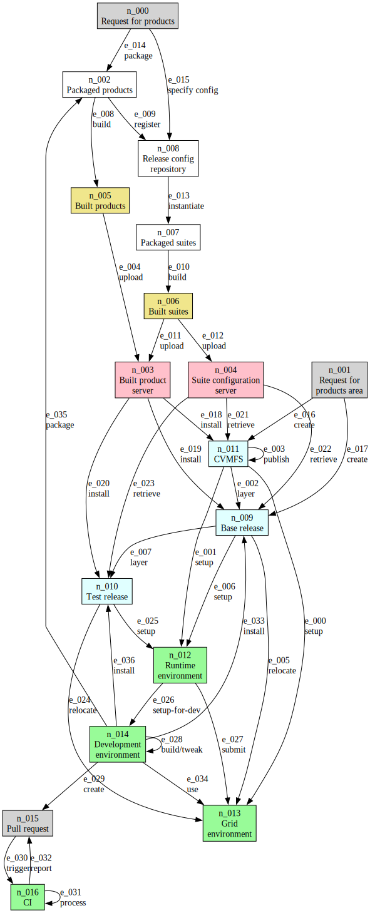

# Revising the Spack Migration Project Goals and Work Plan

## Disclaimer

This document is a *draft*.
No policy described in this document is yet an official policy of the CSAI directorate or the DSSL division.
All items in this document are subject to change.

## Introduction

Because of decreased effort available to the CSAI directorate as a whole, management and completion of this project is now being conducted by the DSSL division.
Effort from the SCSS division available for this project has been sharply curtailed.
As a result we are revising the goals of the project to concentrate on what is most important for allowing the DSSL division to meet its goals, which include the development of a new framework for the DUNE collaboration, support for migrating DUNE and any other interested experiments to the new framework, and maintenance support for the art framework for the remaining lifetimes of the experiments that do not migrate to the new framework.

The changed goals of the project reflect a simultaneous change in some of the goals of DSSL division.
In particular, the major change proposed is moving from a model in which the division delivers built and installable versions of many software products and large software suites on supported platforms and compilers to a model in which the division delivers source code and reference builds that demonstrate the working of that code.
In this document this new model is called the *source code only* model.

The source code only model is intended to have two effects.
One is reducing the burden on the DSSL division, to allow more time to focus on the development of the new framework.
The other is to allow greater flexibility to the experiments, who will be able to use the same mechanisms used by DSSL developers to build their own variants of the product stacks and to support additional platforms that may be of interest to an experiment but which are not supported by Fermilab.

## Project Goals (and some non-goals)

CSAID is switching to Spack to lessen the workload associated with using the Fermilab-supported UPS and its related software tools.
The main goal of the Spack Migration Project is to provide the Spack-besed and Spack-related tools needed for this transition.
This is being done at the same time as the move to the AL9 operating system.
All software support for CSAID-developed software  on AL9  will be based on the use of Spack, rather than the UPS-related tools.
Support for use of SL7 will continue to rely on UPS and the associated tools.
Following Fermilab security policies, the use of SL7 software will be restricted to running in containers based on SL7 and which themselves are run on an AL9 system.
The new spack-based tools will not be supported on SL7 and will not inter-operate with UPS-based tools.

The tools we deliver must support:

1. The DSSL division's development of a new framework for the DUNE collaboration.
2. The DSSL division's continued support of art and related software (the *critic suite*) on AL9
3. The DSSL division's continued support of the LArSoft toolkit.
4. Experiments that choose to use these tools for creation of their own software development and releases.

### Deliverables

In concrete terms, the Spack Migration Project will deliver:

**_Note: please help flesh out the list below list_**.

1. The tools to be used by the SciSoft team for development, testing, and production of reference releases of the SciSoft-provided software packages.
   This include the *critic suite* and the (yet to be named) DUNE framework.
   The tools will make use of Spack rather than UPS, and will be used natively on AL9.

2. Documentation for these tools sufficient for the experiments and projects that use the DUNE framework or art , so that they may make use of the same tools.

3. Procedures and protocols for maintaining FNAL's Spack fork branches.

## Important Assumptions

1. DSSL shall maintain a fork of the Spack repository.
    a. This fork will be kept up-to-date with changes to the main Spack repository as closely as is feasible.
    b. We will use this fork to make bug fixes or add features that are critical to Fermilab use of Spack.
    c. We will feed bug fixes and appropriate features and/or recipe changes back to the main Spack repository as PRs in as timely a fashion as is feasible.

2. DSSL shall maintain the recipes for the software it develops.
    a. These recipes may either reside directly in the DSSL Spack fork or in dedicated recipe repositories apart from the DSSL Spack fork.
    b. We will handle vetting and approval of PRs from experiments and projects adding new recipes or updating existing recipes.
    c. Experiments are always free to submit PRs directly to the main Spack repository, or to maintain their own repository of recipes.
       DSSL will not provide direct support for experiment-owned repositories of recipes or forks of the Spack repository.

3. DSSL shall provide the following Spack support for experiments:
    a. We will provide documentation and tutorials that supplement existing Spack materials, appropriately localized for Fermilab usage.
    b. We will answer questions from project members and experimenters using our tools through SNOW.

4. Using the products of this project, DSSL will build and test new software on Fermilab-defined reference platforms.
    a. A reference platform includes specification of an OS (and its version) and a compiler (and its version and language standard), and processor architecture (e.g. `x86_64_v3`, `aarch64`, or `m2`).
    b. The first reference platform OS and processor architecture is Alma Linux 9 with `x86_64_v3`.

Setting up (1) is part of the Spack Migration Project.

Item (3b) is not part of the Spack Migration Project, and will be determined at the division level.

For (4) we need a plan for dealing with new release of AL9, and eventual migration to support AL10.
We also need a mechanism by which requests for additional platforms can be decided.
Accepting an additional supported platform can be a significant commitment of effort and such acceptance should be decided at a higher level than the SciSoft team.
We want to move to new compiler versions for supported compilers in a timely fashion.

## Terminology

Base release
: A Spack instance containing built packages installed in a shared, non-CVMFS filesystem.

CVMFS release
: A Spack instance containing built packages installed in a CVMFS filesystem.

Test release
: A secondary Spack instance containing built packages requiring either a base release or a CVMFS release for consistent operation.

  We expect a test release to be unique to a single developer.
  A DUNE developer can have a hierarchy of test releases, for example a test release of LArSoft and another test release of the DUNE software dependent on the version of LArSoft in the first test release.
  One could also have a LArSoft developer with multiple test releases of LArSoft, which share some lower-level LArSoft products and which have their own copies of higher-level products.

## Analysis of Work Items from the Spack Retreat

This document uses the same list of "nouns" as did the Spack Retreat, as described in "Spack at FNAL: System Components and Tasks".
It includes an analysis of to what extent each system component remains part of the deliverables of the project in the source code only model.

### Workflow

{alt="Schematic describing stages in anticipated Spack workflows as nodes, with processes implementing progression between stages as edges." height="7.27in"}

## Components

### n_000: Request for products {#request_for_products}

**Brief Description**
: An incoming request for a product to be built and packaged.

**Disposition**

In the source code only model this mostly away, except for self-support and the vetting of pull requests from experiments.

1. PRs will be handled through GitHub.
2. We need to establish a workflow for doing so.
3. We need to have a CI system sufficient for testing PRs on the reference platform(s).

### n_001: Request for products area {#request_for_products_area}

**Brief Description**
: An incoming request for a new area for installed products.

**Disposition**

1. What is the Spack equivalent of an area for installed products?
   Is it (1) a CVMFS directory containing a built spec, or (2) a spack environment, or (3) something else?
2. In the source code only model, DSSL is not responsible for creating CVMFS mount points.
   We will provide environment specifications for our reference builds of the *critic suite* and the DUNE framework.

Should DSSL provide an environment for a reference build of LArSoft?

### n_002: Packaged products {#packaged_products}

**Brief Description**
: One or more packaged products.

**Detailed Description**

 A "packaged product" in the context of Spack is a recipe (`package.py` and any ancillary files such as patches) capable of building the product to the desired specification, along with any new or updated recipes required to build dependencies.
 These recipes should be made available either from Spack's main repository (preferred), or from one or more dedicated recipe repositories accessible to the requester.

**Disposition**

This should be modified to state that recipes should be made available in the DSSL fork of the Spack repository.

Do we accept new recipes from the experimenter community, or do we recommend that each experiment maintain its own repository of recipes?
I think there is significant benefit in keeping a single Fermilab recipe repository.
But we need to do this is way that does not become prohibitively demanding on our time.

###  n_003: Built product server {#scisoft}

**Brief Description**
: An online location from which built products may be obtained.

**Detailed Description**
: Specifically: a Spack build cache to/from which built products may be placed/downloaded by means of Spack commands.

**Disposition**

1. DSSL will maintain a build cache containing the reference builds of the *critic suite* and the DUNE framework.
   Is it sufficient to be able to populate this from scisoftbuild02?
2. Will DSSL maintain a build cache with a reference build of the LArSoft packages?
3. Is the `spack buildcache ...` command implemented sufficiently for our purposes?
4. Is the `spack buildcache ...` command suitable for recommendation for the use of the experiments?

### n_004: Suite configuration server {#suite_config_server}

**Brief Description**
: An online location from which concretized (fully-specified) configurations of consistent suites of built products may be obtained.

**Detailed Description**
: Specifically: `spack.lock` files shall be available to on- and off-site users via HTTPS.

**Detailed status**

* The existing infrastructure for uploading UPS packages, bundle configurations, and manifests, and Spack `spack.yaml` files may be leveraged to upload and provide indexed HTTPS access to `spack.lock` files.
* A naming convention must be conceived and implemented to enable unambiguous identification of fully concretized environment configurations.
* Upload infrastructure must be extended to follow the developed naming convention.
* Infrastructure must be developed to facilitate identification and download of appropriate `spack.lock` files according to the destination architecture, and user requirements.

**Disposition**

1. DSSL shall provide suite configuration for the *critic suite* and for the DUNE framework.
2. Will DSSL provide these for LArSoft?
3. For a source code only model, are these the "final artifacts" for our development?

### n_005: Built products {#built_products}

**Brief Description**
: One or more locally-built products.

**Detailed Description**
: A "built product" is an built and/or installed package within a Spack instance.

**Disposition**

1. DSSL will create these for our own development support for the *critic suite* and the DUNE framework.
2. We need to do this on scisoftbuild02.
   Do we need built products elsewhere?
   What is the best way to do this?
3. Will DSSL create these for LArSoft?
4. Is it appropriate to recommend that the experiments follow our model for how do do this?

### n_006: Built suites {#built_env}

**Brief Description**
: A consistent suite of [built products](#built_products).

**Disposition**

1. Are these Spack environments?
   If not, what are they?
2. What is the relationship between this and the [suite configuration server](#suite_config_server)?
3. DSSL shall create these for our own development support for the *critic suite* and the DUNE framework.
4. Will DSSL create these for LArSoft?

### n_007: Packaged suites {#packaged_suites}

**Brief Description**
: A consistent suite of [packaged products](#packaged_products).

**Disposition**

1. DSSL shall provide these as needed for the development of the *critic suite* and the DUNE framework.
2. Will DSSL provide these for LArSoft?
3. Can this go away in a source code only model?

### n_008: Release config repository {#release_config}

**Brief Description**
: A repository of information containing package and suite information from which a Spack environment may be created.

**Detailed Description**
: Given the desirability of being able to produce different [packaged suites](#packaged_suites) that are consistent and can interoperate with each other, information about package versions and configurations should be accessible for the generation of Spack environments describing suite configurations.

**Detailed status**

* A basic implementation of a release config repository exists at https://cdcvs.fnal.gov/redmine/projects/build-framework/repository
* Package configurations (currently in multiple `.yaml.in` files) should be factored-out and stored in a way more conducive to their consistent reuse in multiple `.yaml.in` files.
*`.yaml.in` files should make use of recent improvements to the provision of YAML `include`{.yaml} facilities in Spack environment configuration files.

**Disposition**

1. What is the relationship between this an the [suite configuration server](#suite_config_server)?
   Is this the repository of information that is served by the suite configuration server?
2. What of this is needed in the source code only model?
   Is this a repository that DSSL will use for our own development?
3. Is there a need for us to be maintaining such a repository containing information about software products we produce that will be accessed by experiments while they make their own releases?

### n_009: Base release {#base_release}

**Brief Description**
: A Spack instance containing built packages installed in a shared, non-CVMFS filesystem.

**Detailed status**
: Scripts exist to facilitate the creation and population of consistently-configured and populated Spack instances.

**Disposition**

0. Is the term *base release* one that is meaningful in the spack model?
   In the SoftRelTools days, a *base release* contained a single version of each package it contained.
   A spack instance could contain multiple versions of the same package.
   Is a *base release* a spack environment?
1. Are these scripts ones that we need to maintain for our own development needs?
2. Are these scripts ones that we will support for experiments' use?
3. In the source code only model we will not maintain base releases for experiments' use.
4. Does this go away in the source code only model?

### n_010: Test release {#test_release}

**Brief Description**
: A secondary Spack instance containing built packages requiring either a base release or a CVMFS Spack instance for consistent operation.

**Detailed status**
: Scripts exist to facilitate the creation and population of consistently-configured and populated Spack instances.

**Disposition**

1. Are these scripts we need for our own development purposes?
2. Are these scripts we will support for the use of experiments?
   Is our usage model one we can recommend to experiments for their own use?
3. In a source code only model, we will not build test releases for experiments.

### n_011: CVMFS {#CVMFS}

**Brief Description**
: A Spack instance containing built packages installed in a CVMFS filesystem.

**Detailed status**
: Scripts exist to facilitate the creation and population of consistently-configured and populated Spack instances.

**Disposition**

1. Will we distribute reference builds of the *critic suite* and the DUNE framework through CVMFS?
   And also reference builds for all the packages upon which these depend?
2. Will we distribute reference builds for LArSoft through CVMFS?
   And all the additional packages upon which LArSoft depends?

### n_012: Runtime environment {#runtime}

**Brief Description**
: An environment configured to use a CVMFS spack instance, base release, or test release for execution purposes.

**Disposition**

1. We need this for our own development purposes for the *critic suite* and the DUNE framework.
2. Do we need this for our own development purposes for LArSoft?
   Who will use it?
   Is this actually useful for experiments, if we are only providing reference builds and not a build tailored for each experiment?
3. We will not provide these for experiment code.

### n_013: Grid environment {#grid}

**Brief Description**
: A non-interactive runtime environment configured for remote and/or batch execution.

**Disposition**

1. This goes away in the source code only model.
   We are not delivering built installations of software that the experiments can use for running useful grid jobs; each needs its own experiment stack for that.
   The *test release* is the mechanism through which the experiments (or individual experimenters) can build the software they want to deliver to a grid node.
   This is similar to the UPS model; we did not deliver the mechanisms used by the experiments to deliver their newly-built software to grid nodes.
2. Who will provide the tools for this work?
   It seems this is in line with the FIFE tools.

### n_014: Development environment {#development}

**Brief Description**
: An interactive runtime environment configured for software development.

**Detailed status**
: See [setup-for-dev](#e_026).

**Disposition**

1. This needs to be completed.
   The current name for this is `spack mpd`.
2. We will use this for our own development.
3. We will support use of this by the experiments and projects.
4. Any experiment that roll its own system will be on its own for support of any such system.

### n_015: Pull requests (PR) {#PR}

**Brief Description**
: One or more related GitHub PRs intended for merge into one or more package source repositories.

**Detailed status**
: The implementation of [trigger](spack.svg#e_030) must specify a way to link PRs in separate repositories for group inclusion in a [CI test process](spack.svg#e_031).

**Disposition**

1. We will manage PRs for repositories we own:
    a. the *critic suite*
    b. the DUNE framework
    c. our fork of the Spack repository
2. Will we manage PRs for LArSoft?
3. We will not manage PRs for any of the experiment repositories.
4. How complete is the infrastructure needed to support automated CI for PRs?
   What support from CSAID or IT do we need?

### n_016: Continuous Integration (CI) {#CI}

**Brief Description**
: A CI system capable of building and testing released, un-released, or unmerged software, or combinations thereof.

**Status**
: **Problematic**

**Detailed status**

* A CI system exists capable of producing [built suites](#built_env) of released products using Spack.
* We require a method of specifying that certain [built products](#built_products) shall be tested while others shall not.
* We require a system capable of providing configured CI processes for different organizations and [built suites](#built_env) that minimizes process-specific accommodations beyond simple CI job configuration.
* We require a system capable of building and testing specified combinations of released, un-released, or unmerged software.
* We require a system capable of building and testing released software in such a way that [built suites](#built_env) may be easily [uploaded](#e_012) to a [built product server](#scisoft).

**Disposition**

1. We need a sufficient CI system for testing the *critic suite* and the DUNE framework, and for all of our reference builds.
2. This need is one of the limiting factors on the number of reference platforms we can support.
3. Who will support the CI system for LArSoft?
   What CI can be run using LArSoft alone, without experiment code?
   It may be that each experiment needs to run its own CI, testing the LArSoft builds in which it is interested.
   It is unclear how PRs for LArSoft can be rationally managed without having a CI system for LArSoft.
4. We will not support CI for any of the experiment repositories.

## Tasks

### e_000: setup {#e_000}

**Brief Description**
: Set up a [grid environment](#grid) to use a specific [CVMFS-based Spack instance](#CVMFS).

**Status**
: **Done**

**Detailed status**
: Given an existing [CVMFS-based Spack instance](#CVMFS), the `make_subspack` script will create and configure a subordinate Spack instance.

**Disposition**

1. Are the scripts or other code for doing this task completed?
2. Who will provide user support for them?
3. Is this support to be provided through SNOW?

### e_001: setup {#e_001}

**Brief Description**
: Set up an [interactive environment](#runtime) to use a specific [CVMFS-based Spack instance](#CVMFS).

**Status**
: **Done**

**Detailed status**
: Given an existing [CVMFS-based Spack instance](#CVMFS), the `make_subspack` script will create and configure a subordinate Spack instance.

**Disposition**

1. Are the scripts or other code for doing this task completed?
2. Who will provide user support for them?
3. Is this support to be provided through SNOW?

### e_002: layer {#e_002}

**Brief Description**
: Create a [base release](#base_release) as a "sub-spack" dependent on a [CVMFS-based Spack instance](#CVMFS).

**Status**
: **Done**

**Detailed status**
: Given an existing [CVMFS-based Spack instance](#CVMFS), the `make_subspack` script will create and configure a subordinate Spack instance.

**Disposition**

1. Note that DSSL will not be creating "base releases" for experiment code.
2. Are the scripts or other code for doing this task completed?
3. Who will provide user support for them?
4. Is this support to be provided through SNOW?

### e_003: publish {#e_003}

**Brief Description**
: Make changes to a [CVMFS-based Spack instance](#CVMFS) visible.

**Status**
: **Done**

**Detailed status**
: The ability to publish changes to a CVMFS-based filesystem is an existing feature of the system.

**Disposition**

1. DSSL will not be provided spack instances for experiments.
2. DSSL will publish the reference builds of the *critic suite* and the DUNE framework.
3. Will DSSL publish the reference builds of LArSoft?

### e_004: upload {#e_004}

**Brief Description**
: Upload one or more [built products](#built_products) to a [server](#scisoft).

**Status**
: **Almost done**

**Detailed status**

* Spack build caches are provided in multiple public, online locations by Fermilab.
* We must organize, consolidate, and document the availability of public build caches.
* We must provide for the long term maintenance and storage requirements of public build caches.
* We must be aware of and have a plan to manage possible compatibility issues caused by uploading built products to a build cache with different versions of Spack.

**Disposition**

1. In the source code only model, DSSL would only provide reference builds of the *critic suite* and the DUNE framework, and possibly of LArSoft.
2. Who are the intended users of these builds?
3. Is it feasible to expect that the references builds generated by DSSL would actually be used directly by the experiments as the base for their own builds?

### e_005: relocate {#e_005}

**Brief Description**
: Make a [base release](#base_release) accessible in a [grid environment](#grid).

**Detailed Description**
: In the absence of a shared filesystem, create a [grid environment](#grid) containing the elements of a given [base release](#base_release) necessary to enable the desired remote computational activity.

**Status**
: **Almost done**

**Detailed status**

* The facility exists to be able to export the necessary built products and/or suites to a build cache which can then be uploaded to a remote node as part of a grid submission.
* We require a script enabling a user to specify the required software environment and execute the packaging operations necessary to export same.
* We need to provide a mechanism for submitting grid jobs which will ensure the upload of the created build cache, and its use in creating a correctly configured execution environment on the execution node.

**Disposition**

1. Is the script or other code for doing this task completed?
   If not, how much work is remaining?
2. Who will provide user support for them?
   Is this a task for FIFE, as integration with [Jobsub_Lite](https://fifewiki.fnal.gov/wiki/Jobsub_Lite)?
3. Is this support to be provided through SNOW?

### e_006: setup {#e_006}

**Brief Description**
: Set up an [interactive environment](#runtime) to use a specific [base release](#base_release).

**Status**
: **Done**

**Detailed status**
: Given an existing [base release](#base_release), the `make_subspack` script will create and configure a subordinate Spack instance.

**Disposition**

1. Is the script or other code for doing this task completed?
2. Who will provide user support for them?
3. Is this support to be provided through SNOW?

### e_007: layer {#e_007}

**Brief Description**
: Create a [test release](#test_release) as a "sub-spack" dependent on a [base release](#base_release).

**Status**
: **Done**

**Detailed status**
: Given an existing [base release](#base_release), the `make_subspack` script will create and configure a subordinate Spack instance.

**Disposition**

1. Is the script or other code for doing this task completed?
2. Who will provide user support for them?
3. Is this support to be provided through SNOW?

### e_008: build {#e_008}

**Brief Description**
: Produce one or more [built products](#built_products) by following the recipes provided by the corresponding [packaged products](#packaged_products).

**Status**
: **Done**

**Detailed status**
: The required functionality is provided by the `spack install` command.

**Disposition**

1. There is nothing to do for this item.

### e_009: register {#e_009}

**Brief Description**
: Upload [non-concretized (loosely specified) configurations](#packaged_products) of suites of products to the [release config repository](#release_config).

**Status**
: **Almost done**

**Detailed status**

* See current status of [release config repository](#release_config).
* A suitable online location (`https://scisoft.fnal.gov/packages/.../buildcfg/`) exists to which to upload generated or manually-created Spack environment configuration files.
* The `copyToSciSoft` script is capable of uploading a suitably-named Spack environment configuration file to an appropriate online location.
* The naming convention must be documented.
* The upload procedure must be documented.

**Disposition**

1. Is some or all of this needed in the source code only model?
2. If it is needed, is this for our own development work, or is this a tool to be support for the use of experiments?

### e_010: build {#e_010}

**Brief Description**
: Build a [specified consistent suite](#packaged_suites) of [packaged products](#built_env).

**Status**
: **Almost done**

**Detailed status**

* The `build-spack-env.sh` script enables the creation of one or more [specified consistent suites](#packaged_suites) given corresponding Spack environment configurations.
* We require a facility to locate and retrieve Spack environment configurations from their [online repository](#suite_config_server) where appropriate.

**Disposition**

1. What parts of this are needed in the source code only model?
2. If it is needed, is this for our own development work, or is this a tool to be support for the use of experiments?j

### e_011: upload {#e_011}

**Brief Description**
: Upload [built products](#built_env) to an [online location](#scisoft).

**Status**
: **Almost done**

**Detailed status**

* `spack buildcache create` is the appropriate upload mechanism to use for this task.
* The appropriate online location(s) for specific products and/or organizations should be documented, along with any specific authentication/authorization procedures required.

**Disposition**

1. Is this for our own development work, or is this a tool to be support for the use of experiments?

### e_012: upload {#e_012}

**Brief Description**
: Upload the concretized (fully-specified) configuration for a consistent suite of [built products](#built_env) to a [server](#suite_config_server).

**Status**
: **In progress**

**Detailed status**

* A suitable online location (`https://scisoft.fnal.gov/packages/.../`) exists to which to upload the `spack.lock` files created during a [build](#e_010) procedure.
* We require a suitable directory organization on the [online location](#suite_config_server).
* We must decide upon a suitably specific naming convention for `spack.lock` files and provide the means to rename `spack.lock` files according to that convention.
* We must adapt the `copyToSciSoft` script (or provide a suitable alternative) to upload `spack.lock` files to an appropriate location on the [online location](#suite_config_server), creating necessary directory structure and indexing facilities as appropriate.

**Disposition**

1. In the source code only model, who are the expected users of these uploads?
   We should be tailoring our work to best support those users, with an eye toward how to minimize the ongoing maintenance burden on our end.

### e_013: instantiate {#e_013}

**Brief Description**
: Create a suitably-configured Spack instance, and generate a Spack environment describing a specific consistent suite of [packaged products](#packaged_suites) from information in a [release configuration repository](#release_config).

**Status**
: **Almost done**

**Detailed status**

* We have scripts (`make_spack`, `make_subspack`) to create suitably-configured Spack instances.
  The `build-spack-env.sh` script combines the [instantiate](spack.svg#e_013) and [build](spack.svg#e010) tasks.
* We require a facility to locate and retrieve Spack environment configurations from their [online repository](#suite_config_server) where appropriate.

**Disposition**

1. We need this for our own development work.
2. We should support this for the use of experiments.
3. Can all the relevant scripts be turned into spack extensions?
4. Can all the spack extensions be managed in our fork of the Spack repository, or is it better to have an additional repository for our spack extensions?
   Is there a reason to have more than one repository for spack extensions?
5. How do experiments that use our spack extensions get access to them?

### e_014: package {#e_014}

**Brief Description**
: Create [Spack recipe(s)](#packaged_products) describing how to build [requested products](#request_for_products).

**Detailed Description**
: Spack `package.py` shall be created or generated, along with any necessary auxiliary files (e.g. patches).

**Status**
: **Almost done**

**Detailed status**

* `spack create` will create a basic `package.py` from a Spack template which can then be filled out to provide a full recipe for building the product.
* We require a script or template to enable straightforward generation of recipes for building and using experiment-originated products such as those utilizing ROOT, or framework plugin libraries.

**Disposition**

1. One of our reasons for moving to the use of spack was to reduce our labor in the creation of new packaged products, and to remove ourselves as a bottleneck to the experimenters' creation of new packages.
2. Why is there anything for us to support in the source code only model?

### e_015: specify config {#e_015}

**Brief Description**
: Add information to the [release config repository](#release_config) to enable the creation of the [requested products](#request_for_products) via generated Spack environments.

**Status**
: **Almost done**

**Detailed status**

* For the [release config repository](#release_config) in its current form, "adding information" consists of making appropriate alterations to the `bundle/CMakeLists.txt` file and creating or modifying one or more `yaml.in` files.
* See current status of [release config repository](#release_config).

**Disposition**

1. What parts of this are needed in the source code only model?
2. If it is needed, is this for our own development work, or is this a tool to be support for the use of experiments?

### e_016: create {#e_016}

**Brief Description**
: Create and publish a [Spack instance in a CVMFS filesystem](#grid) according to an [initial request](#request_for_products_area).

**Detailed Description**
: ...

**Status**
: **Almost done**

**Detailed status**
: See current status of [instantiate](#e_013).

**Disposition**

1. We will be doing this for our own development work.
2. Experiments will do this for themselves, using tools we provide.
3. DSSL will provide SNOW support for the experiments.

### e_017: create {#e_017}

**Brief Description**
: Create a [Spack instance in a shared, non-CVMFS filesystem](#base_release) according to an [initial request](#request_for_products_area).

**Status**
: **Almost done**

**Detailed status**
: See current status of [instantiate](#e_013).

**Disposition**

1. We will be doing this for our own development work.
2. Experimenters (each developer, not experiments) will do this for themselves, using tools we provide.
3. DSSL will provide SNOW support for the experimenters.

### e_018: install {#e_018}

**Brief Description**
: Obtain built products from a [server](#scisoft) to create a [CVMFS release](#test_release).

**Status**
: **Done**

**Detailed status**
: The `build-spack-env.sh` script enables the creation of one or more [specified consistent suites](#packaged_suites) given corresponding Spack environment configurations.
  These products may be obtained pre-built from suitably-configured local or remote Spack build caches.

**Disposition**

1. Is this a thing that needs to be done in an source code only model?
2. If so, who is doing it?

### e_019: install {#e_019}

**Brief Description**
: Obtain built products from a [server](#scisoft) to create a [base
  release](#base_release) with the desired configuration.

**Status**
: **Almost done**

**Detailed status**

* The `build-spack-env.sh` script enables the creation of one or more [specified consistent suites](#packaged_suites) given corresponding Spack environment configurations.
  These products may be obtained pre-built from suitably-configured local or remote Spack build caches.
* `build-spack-env.sh` must be enhanced to enable the creation of appropriately configured Spack instances subordinate to an already-populated upstream instance.

**Disposition**

1. Is this a thing that needs to be done in an source code only model?
2. If so, who is doing it?

### e_020: install {#e_020}

**Brief Description**
: Obtain built products from a [server](#scisoft) to create a [test release](#test_release) with the desired configuration.

**Status**
: **Almost done**

**Detailed status**
: See current status of [install](#e_019).

**Disposition**

1. Is this a thing that needs to be done in an source code only model?
2. If so, who is doing it?

### e_021: retrieve {#e_021}

**Brief Description**
: Obtain the necessary specific suite configurations from the [configuration server](#suite_config_server) to create a [CVMFS release](#CVMFS) with the desired configuration.

**Status**
: **In progress**

**Detailed status**

* See current status of [suite configuration server](#suite_config_server).
* The `build-spack-env.sh` script enables the creation of one or more [specified consistent suites](#packaged_suites) given corresponding Spack environment configurations.
  These products may be obtained pre-built from suitably-configured local or remote Spack build caches.
* `build-spack-env.sh` must be enhanced to enable the creation of Spack environments based on local or remote `spack.lock` files, including the ability to locate on and retrieve `spack.lock` files from a [suite configuration server](#suite_config_server).

**Disposition**

1. Is this a thing that needs to be done in an source code only model?
2. If so, who is doing it?

### e_022: retrieve {#e_022}

**Brief Description**
: Obtain the necessary specific suite configurations from the [configuration server](#suite_config_server) to create a [base release](#base_release) with the desired configuration.

**Status**
: **In progress**

**Detailed status**

* See the current status of [retrieve](#e_021).
* See the current status of [instantiate](#e_019).

### e_023: retrieve {#e_023}

**Brief Description**
: Obtain the necessary specific suite configurations from the [configuration server](#suite_config_server) to create a [test release](#test_release) with the desired configuration.

**Status**
: **In progress**

**Detailed status**
: See the current status of [retrieve](#e_022).

### e_024: relocate {#e_024}

**Brief Description**
: Make a [test release](#test_release) accessible in a [grid environment](#grid).

**Status**
: **Almost done**

**Detailed status**
: See the current status of [relocate](#e_005).

**Disposition**

1. This will be done by experimenters, using tools that we provide.
2. DSSL will provide experiments support in this through SNOW.

### e_025: setup {#e_025}

**Brief Description**
: Set up an [interactive environment](#runtime) to use a specific [test release](#test_release).

**Status**
: **Done**

**Detailed status**
: Given an existing [test release](#test_release), `make_subspack` script will create and configure a subordinate Spack instance.

**Disposition**

1. This is an activity that will be performed by experimenters.
2. DSSL will provide experiments support in this through SNOW.

### e_026: setup-for-dev {#e_026}

**Brief Description**
: Convert an [interactive environment](#runtime) into an [environment suitable for the development of one or more products](#development).

**Status**
: **In progress**

**Detailed status**
: We are developing `spack mpd` for this purpose.

**Disposition**

1. We will use this for our own development purposes.
2. DSSL will support this, through SNOW, for use by experiments who choose to use it.

### e_027: submit {#e_027}

**Brief Description**
: Make an [interactive environment](#runtime) accessible in a [grid environment](#grid).

**Status**
: **Almost done**

**Detailed status**
: See the current status of [relocate](#e_005).

**Disposition**

1. Experimenters will use this.
2. DSSL will provide experiments support in this through SNOW.

### e_028: build {#e_028}

**Brief Description**
: Build from local sources, making necessary changes or additions to local sources in an interactive [development environment](#development).

**Status**
: **In progress**

**Detailed status**
: See status of [setup-for-dev](#e_026).

### [e_029](spack.svg#e_029): create {#e_029}

**Brief Description**
: Create a [GitHub PR](#PR) based on sources in a [development environment](#development).

**Status**
: **Done**

**Detailed status**

* `git` or `gh` commands may be used to commit and push local changes to a branch on a remote repository for a product or fork thereof on GitHub.
* `gh` commands or GitHub web UI operations may be used to submit a PR to the source repository for a product.

**Disposition**

1. We will be doing this for our own development purposes.
2. DSSL will support this, through SNOW, for use by experiments who choose to use our tools.

### e_030: trigger {#e_030}

**Brief Description**
: Trigger a build process in a [CI](#CI) system based on a [GitHub PR](#PR).

**Status**
: **Almost done**

**Detailed status**

* See relevant details of current status of [continuous integration](#CI).
* See current status of [pull requests](#PR).

**Disposition**

1. We need this CI support for our own development purposes.
2. Who will be doing this for LArSoft?
3. Experiments will need to support their own CI efforts.
4. Will DSSL support experiments in use of our tools for this?

### e_031: process {#e_031}

**Brief Description**
: Execute Spack-based builds in a [CI](#CI) system.

**Detailed Description**
: ...

**Status**
: **In progress**

**Detailed status**
: See relevant details of current status of [continuous integration](#CI).

**Disposition**

1. We need this CI support for our own development purposes.
2. Who will be doing this for LArSoft?
3. Experiments will need to support their own CI efforts.
4. Will DSSL support experiments in use of our tools for this?

### e_032: report {#e_032}

**Brief Description**
: Retrieve status and built products from a [CI](#CI) system, updating the state of the triggering [PR](#PR).

**Status**
: **Almost done**

**Detailed status**

* Built products may be retrieved from a completed [CI](#CI) execution using the Jenkins web UI.
* See relevant details of current status of [continuous integration](#CI).

**Disposition**

1. We need the ability to monitor the success of CI builds for our own development purposes.
2. Is the retrieval of built products needed for our own purposes?

### e_033: install {#e_033}

**Brief Description**
: Install [locally-built products](#development) into a [base release](#base_release).

**Status**
: **Done**

**Detailed status**
: The facility exists to be able to export the necessary built products and/or suites to a build cache, which can then be used to install the built products into a different Spack instance via `spack install`.

### e_034: use {#e_034}

**Brief Description**
: Use [locally-built products](#development) in a [grid environment](#grid).

**Status**
: **Almost done**

**Detailed status**
: See current status of [relocate](#e_005).

**Disposition**

1. Experimenters will use this.
2. DSSL will provide experiments support in this through SNOW.

### e_035: package {#e_035}

**Brief Description**
: Finalize [recipe changes/additions](#packaged_products) from [development environment](#development)

**Status**
: **Done**

**Detailed status**
: Text editors exist.

### e_036: install {#e_036}

**Brief Description**
: Install products built in a [development environment](#development) into a [test release](#test_release).

**Status**
: **Done**

**Detailed status**
: See current status of [install](#e_033).
